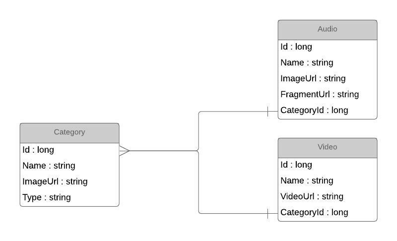

Limino switch2 back-end project
------------------------------------------------------------------------------------------

Entities' basic layout
==========================================================================================

Api call datastructures
==========================================================================================

Everything mentioned between :code:`{ }` is a suggestion unless it's a JSON object.

e.g.: :code:`/categories?type={video||audio||conversation}` becomes :code:`/categories?type=video`

/categories?type={video||audio||conversation}
++++++++++++++++++++++++++++++++++++++++++++++++++++++++++++++++++++++++++++++++++++++++++

Returns all categories for videos, audio fragments or conversations.

.. code-block:: json

    {
        "data":[
            {
                "id": 1,
                "name": "Eten",
                "imageUrl": "{some-uuid}"
            },
            {
                "id": 2,
                "name": "Postkantoor",
                "imageUrl": "{some-uuid}"
            },
            ...
        ]
    }

/video/?category={categoryId}
++++++++++++++++++++++++++++++++++++++++++++++++++++++++++++++++++++++++++++++++++++++++++

Returns all videos for a particular category specified by the category's id.

.. code-block:: json

    {
        "data":[
            {
                "id": 1,
                "name": "Vraag een appel",
                "videoUrl": "{some-yt-link}"
            },
            {
                "id": 2,
                "name": "Zeg dat je te laat zal zijn",
                "videoUrl": "{some-yt-link}"
            },
            ...
        ]
    }

/audio/?category={categoryId}
++++++++++++++++++++++++++++++++++++++++++++++++++++++++++++++++++++++++++++++++++++++++++

Returns all audio fragments for a particular category specified by the category's id.

.. code-block:: json

    {
        "data":[
            {
                "id": 1,
                "name": "Appel",
                "imageUrl": "{some-uuid}"
                "fragmentUrl": "{some-fragment-url/some-uuid}"
            },
            {
                "id": 2,
                "name": "Peer",
                "imageUrl": "{some-uuid}"
                "fragmentUrl": "{some-fragment-url/some-uuid}"
            },
            ...
        ]
    }

/excercises/?category={categoryId}&type={audio|video|conversation}
++++++++++++++++++++++++++++++++++++++++++++++++++++++++++++++++++++++++++++++++++++++++++

Returns a series of excercises from a category and type. (Categories will probably be
unique, and their uniqueness will be used so that a type is unnessecary)

.. code-block:: json

    {
        "data":[
            {
                "type": "collage|trueorfalse|multiplechoice",
                "categoryId": "some-uuid",
                "questionUrl": "some-string",
                "name": "some-string",
                "videoUrl": "some-video-url",
                "answers": [{
                    "imageUrl": "some-image-url",
                    "audioUrl": "some-audio-url",
                    "correct: true
                }, ... ]
            },
            {
                "type": "collage|trueorfalse|multiplechoice",
                "categoryId": "some-uuid",
                "questionUrl": "some-string",
                "name": "some-string",
                "videoUrl": "some-video-url",
                "answers": [{
                    "imageUrl": "some-image-url",
                    "audioUrl": "some-audio-url",
                    "correct: true
                }, ... ]
            },
            ...
        ]
    }

